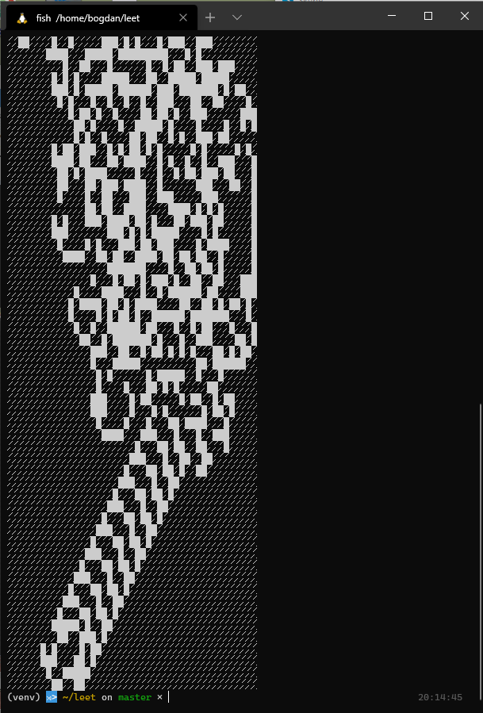
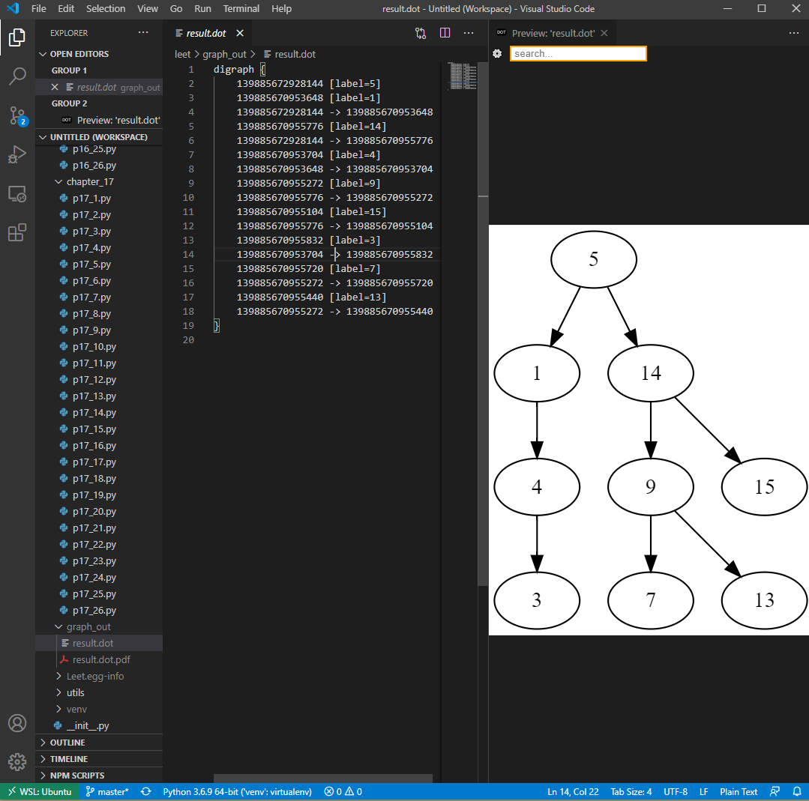

# Python Solutions to Cracking the Coding Interview (6th edition)
> Exiting Python solutions can be found [officially here](https://github.com/careercup/CtCI-6th-Edition-Python/tree/e6bc732588601d0a98e5b1bc44d83644b910978d) and [user-created here](https://github.com/w-hat/ctci-solutions)

### Current progress
| Nr. 	|         Chapter        	| Done 	| Total 		| Ommited 	|
|:---:	|:----------------------:	|:----:	|:-----:	|:-------:	|
|   1 	| [Array and String](chapter_1)       	|   9  	|   9   	|       	|         	|
|   2 	| [Linked Lists](chapter_2)           	|   8  	|   8   	|         	|
|   3 	| [Stacks and Queues](chapter_3)      	|   6  	|   6   	|    1    	|
|   4 	| [Trees and Graphs](chapter_4)       	|  12  	|   12  	|         	|
|   5 	| [Bit Manipulation](chapter_5)       	|   8  	|   8   	|         	|
|   6 	| [Math and Logic Puzzles](chapter_6) 	|  10  	|   10  	|    4    	|
|   7 	| [OO Design](chapter_7)              	|   0  	|   12  	|         	|
|   8 	| [Recursion and DP](chapter_8)       	|  14  	|   14  	|         	|
|   9 	| [System Design](chapter_9)          	|   0  	|   8   	|         	|
|  10 	| [Sorting and Searching](chapter_10) 	|   9  	|   11  	|    1    	|
|  11 	| [Testing](chapter_11)                	|   4  	|   6   	|    4    	|
|  12 	| [C/C++](chapter_12)                  	|  11  	|   11  	|    11   	|
|  13 	| [Java](chapter_13)                   	|   0  	|   8   	|         	|
|  14 	| [Databases](chapter_14)              	|   0  	|   7   	|         	|
|  15 	| [Threads and Locks](chapter_15)      	|   0  	|   7   	|         	|
|  16 	| [Moderate](chapter_16)               	|  26  	|   26  	|    1    	|
|  17 	| [Hard](chapter_17)                   	|  26  	|   26  	|         	|


### Running the solutions

For convenience, the project has a `setup.py` that specifies a package
This can be installed locally in the virtualenvironment by using
```bash
pip install -e .
```

Problems can be run by running the file, most should have a main method.
```bash
python p16_20.py
```

## Some highlights

### Langton's ant (Chapter 16, Problem 22)



An interesting example of emergent patterns from simple rules. Raise the number of iterations in the code to see more of the "highway" form.  
For more information, check the [wikipedia link](https://en.wikipedia.org/wiki/Langton%27s_ant).

### Tree visualising in VS Code



This requires graphviz to be installed locally and the extension added to VS Code.   
The one used in the screenshot can be found [here](https://marketplace.visualstudio.com/items?itemName=tintinweb.graphviz-interactive-preview) 

